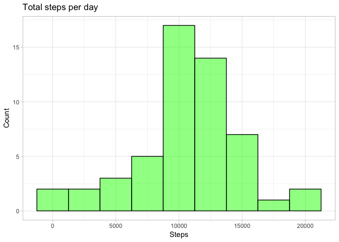
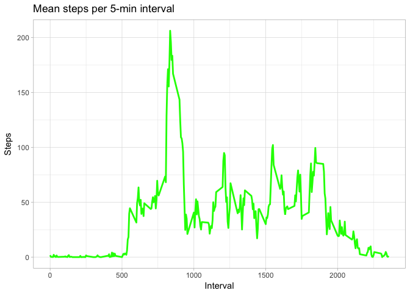
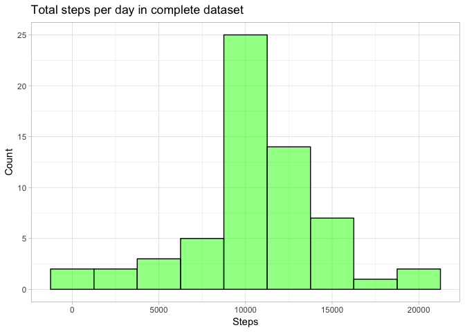
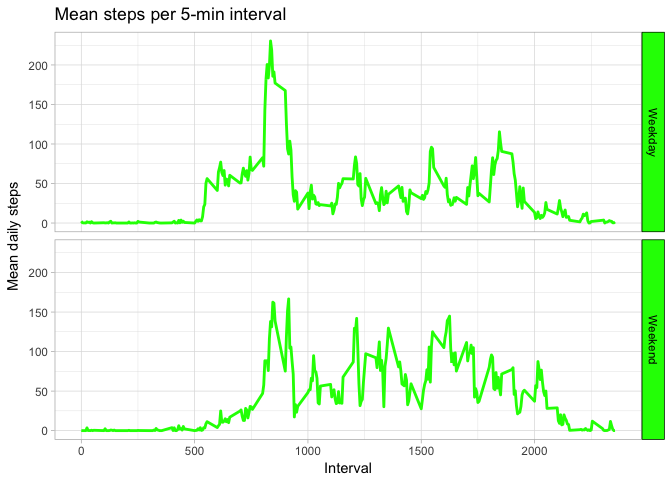

Before we get started, we set the path to the figures used in the document:

```r
knitr::opts_chunk$set(fig.path='figure/')
```

## Loading and preprocessing the data
First, the data is extracted and loaded to a dataframe from the given "activity.zip" file.

```r
act <- read.csv(unzip("activity.zip"))
act$date <- as.Date(as.character(act$date), "%Y-%m-%d")
```


## What is mean total number of steps taken per day?

1. Calculating the total steps per day

```r
dailyAct <- aggregate(act$steps, by = list(act$date), FUN = sum)
names(dailyAct) <- c("Date", "Steps")
```

2. Plotting the total number of steps per day

```r
library(ggplot2)

# Creating histogram and deciding a binwidth of 2500 
ggplot(data = na.omit(dailyAct), aes(x=Steps)) +
     geom_histogram(binwidth = 2500, col="black", fill = "green", 
                    alpha = .5) +
     theme_light() +
     labs(title = "Total steps per day", y = "Count")
```

<!-- -->

3. Calculating the mean and median steps per day

```r
# Calculating and reporting the mean steps
print(dailyMean <- mean(dailyAct$Steps, na.rm = TRUE))
```

```
## [1] 10766.19
```

```r
# Calculating and reporting the median steps
print(dailyMedian <- median(dailyAct$Steps, na.rm = TRUE))
```

```
## [1] 10765
```

## What is the average daily activity pattern?

1. Time series plot of the 5-minute intervals and mean steps taken

```r
# Aggregating the mean by intervals
intervalMean <- aggregate(act$steps, by = list(act$interval), 
                         FUN = mean, na.rm = TRUE)
names(intervalMean) <- c("Interval", "Steps")

# Plotting the result
ggplot(data = intervalMean, aes(x=Interval, y=Steps)) +
     geom_line(colour="green", size = 1) +
     theme_light() + 
     labs(title = "Mean steps per 5-min interval")
```

<!-- -->

2. Which 5-minute interval on average contains the max number of steps?

```r
# Determining the max average interval by assigning it to a dataframe
intervalMax <- intervalMean[which.max(intervalMean$Steps), ]

# The 5-min interval with the most steps
intervalMax$Interval
```

```
## [1] 835
```

```r
# Number of steps in the interval
intervalMax$Steps
```

```
## [1] 206.1698
```


## Imputing missing values
1. Calculating and reporting the total number of missing values (NAs) in the dataset.

```r
# Calculating the number of NAs in dataset
sum(is.na(act))
```

```
## [1] 2304
```

2 & 3. Filling in the missing values in the dataset using mean of the given 5-minute interval

```r
# Creating a new dataset for complete interval measurements
cAct <- act

# Determining NAs and replacing with means for the given interval
for (i in 1:nrow(cAct)) {
     if (is.na(cAct$steps[i])) {
          # Rounding the steps with 0 decimals (whole steps make sense)
          cAct$steps[i] <- 
               round(intervalMean$Steps[intervalMean$Interval == 
                                       cAct$interval[i]], 0)
     }
}
```

4a. Making a histogram of the total number of steps each day


```r
# Calculating total steps with complete dataset, grouping by date
cDailyAct <- aggregate(cAct$steps, by = list(cAct$date), FUN = sum)
names(cDailyAct) <- c("Date", "Steps")

# Plotting total steps with complete dataset in histogram
ggplot(data = cDailyAct, aes(x=Steps)) +
     geom_histogram(binwidth = 2500, col="black", fill = "green", 
                    alpha = .5) +
     theme_light() +
     labs(title = "Total steps per day in complete dataset", y = "Count")
```

<!-- -->

```r
# Calculating and reporting the mean and median steps per day
print(cDailyMean <- mean(cDailyAct$Steps))
```

```
## [1] 10765.64
```

```r
print(cDailyMedian <- median(cDailyAct$Steps))
```

```
## [1] 10762
```

```r
# Calculating the change to the mean and median in complete set
print(changeMean <- round((cDailyMean - dailyMean), digits = 2))
```

```
## [1] -0.55
```

```r
print(changeMedian <- round((cDailyMedian - dailyMedian), digits = 2))
```

```
## [1] -3
```

We can see that the effect of imputing the dataset´s NAs has changed the mean by -0.55 steps and the median by -3 steps.

## Are there differences in activity patterns between weekdays and weekends?

1. Creating a new factor variable with levels "weekday" and "weekend" to indicate given day type in the dataset:

```r
# Assigning day numbers (0-6) according to date
dayNo <- as.POSIXlt(cAct$date)$wday

# Creating the new factor with two levels
dayType <- factor(levels = c("Weekday", "Weekend"))

# Looping through values in dayNo to determine Weekday/Weekend
for (i in 1:length(dayNo)){
     if (dayNo[i] == 0 | dayNo[i] == 6) {
          # The day is a Sunday or Saturday
          dayType[i] <- "Weekend"
     } else {
          dayType[i] <- "Weekday"
     }
}

 # Binding the updated factor to the dataset
dayAct <- cbind(cAct, dayType)
```

2. Make a panel plot containing a time series plot (i.e. 𝚝𝚢𝚙𝚎 = "𝚕") of the 5-minute interval (x-axis) and the average number of steps taken, averaged across all weekday days or weekend days (y-axis).


```r
# Calculating averages per day type
dayTypeMeans <- 
     aggregate(dayAct$steps, by = list(dayAct$interval,dayAct$dayType),
               FUN = mean)
names(dayTypeMeans) <- c("Interval", "DayType", "MeanSteps")

ggplot(data = dayTypeMeans, aes(x = Interval, y = MeanSteps)) +
     geom_line(colour="green", size = 1) +
     facet_grid(DayType ~ .) +
     theme_light() + 
     theme(strip.text.y = element_text(color = "black"),
          strip.background = element_rect(colour="black", fill="green")) +
     labs(title = "Mean steps per 5-min interval", y = "Mean daily steps")
```

<!-- -->
