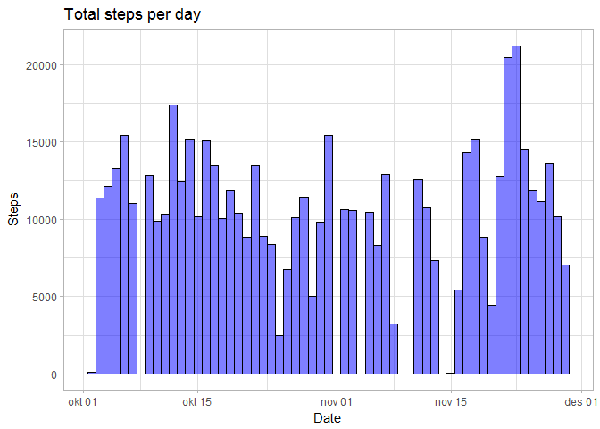
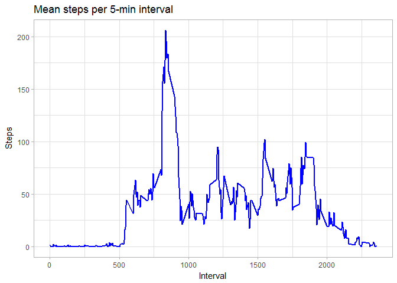
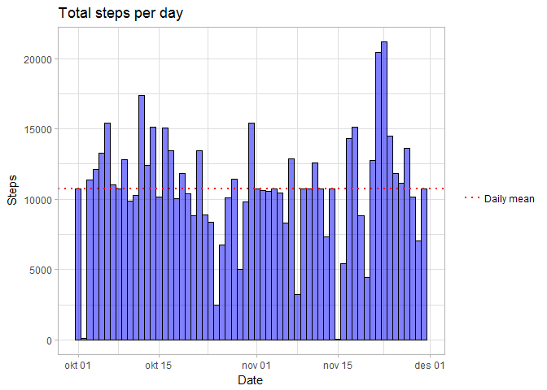

# Reproducible Research: Peer Assessment 1
Christoffer Haukvik  


## Loading and preprocessing the data
First, the data is extracted and loaded to a dataframe from the given "activity.zip" file.

```r
act <- read.csv(unzip("activity.zip"))
act$date <- as.Date(as.character(act$date), "%Y-%m-%d")
```


## What is mean total number of steps taken per day?

1. Calculating the total steps per day

```r
dailyAct <- aggregate(act$steps, by = list(act$date), FUN = sum)
names(dailyAct) <- c("Date", "Steps")
```

2. Plotting the total number of steps per day

```r
library(ggplot2)
ggplot(data = dailyAct, aes(x=Date, y=Steps)) +
     geom_col(col="black", fill = "blue", 
              width = 1, alpha=.5) +
     theme_light() +
     labs(title = "Total steps per day")
```

<!-- -->

3. Calculating the mean and median steps per day

```r
dailyMean <- mean(dailyAct$Steps, na.rm = TRUE)
dailyMedian <- median(dailyAct$Steps, na.rm = TRUE)
```
Mean steps per day are 1.0766189\times 10^{4}.  
Median steps per day are 10765.

## What is the average daily activity pattern?

1. Time series plot of the 5-minute intervals and mean steps taken

```r
intervalMean <- aggregate(act$steps, by = list(act$interval), 
                         FUN = mean, na.rm = TRUE)
names(intervalMean) <- c("Interval", "Steps")
ggplot(data = intervalMean, aes(x=Interval, y=Steps)) +
     geom_line(colour="blue", size = 1) +
     theme_light() + 
     labs(title = "Mean steps per 5-min interval")
```

<!-- -->

2. Which 5-minute interval on average contains the max number of steps?

```r
intervalMax <- intervalMean[which.max(intervalMean$Steps), ]
```
The 5-minute interval 835 has the most steps (206 steps).

## Imputing missing values
1. Calculating and reporting the total number of missing values (NAs) in the dataset.

```r
length(is.na(act))
```

```
## [1] 52704
```

2 & 3. Filling in the missing values in the dataset using mean of the given 5-minute interval

```r
# Creating a new dataset for complete interval measurements
cAct <- act

# Determining NAs and replacing with means for the given interval
for (i in 1:nrow(cAct)) {
     if (is.na(cAct$steps[i])) {
          cAct$steps[i] <- 
               intervalMean$Steps[intervalMean$Interval == 
                                       cAct$interval[i]]
     }
}
```

4. Make a histogram of the total number of steps taken each day and Calculate and report the mean and median total number of steps taken per day. Do these values differ from the estimates from the first part of the assignment? What is the impact of imputing missing data on the estimates of the total daily number of steps?


```r
# Calculating total steps with complete dataset
cDailyAct <- aggregate(cAct$steps, by = list(cAct$date), FUN = sum)
names(cDailyAct) <- c("Date", "Steps")

# Plotting total steps with complete dataset
ggplot(data = cDailyAct, aes(x=Date, y=Steps)) +
     geom_col(col="black", fill = "blue", 
              width = 1, alpha=.5) +
     theme_light() +
     labs(title = "Total steps per day")
```

<!-- -->

```r
# Calculating and reporting the mean and median steps per day
cDailyMean <- mean(cDailyAct$Steps, na.rm = TRUE)
cDilyMedian <- median(cDailyAct$Steps, na.rm = TRUE)
```


## Are there differences in activity patterns between weekdays and weekends?
